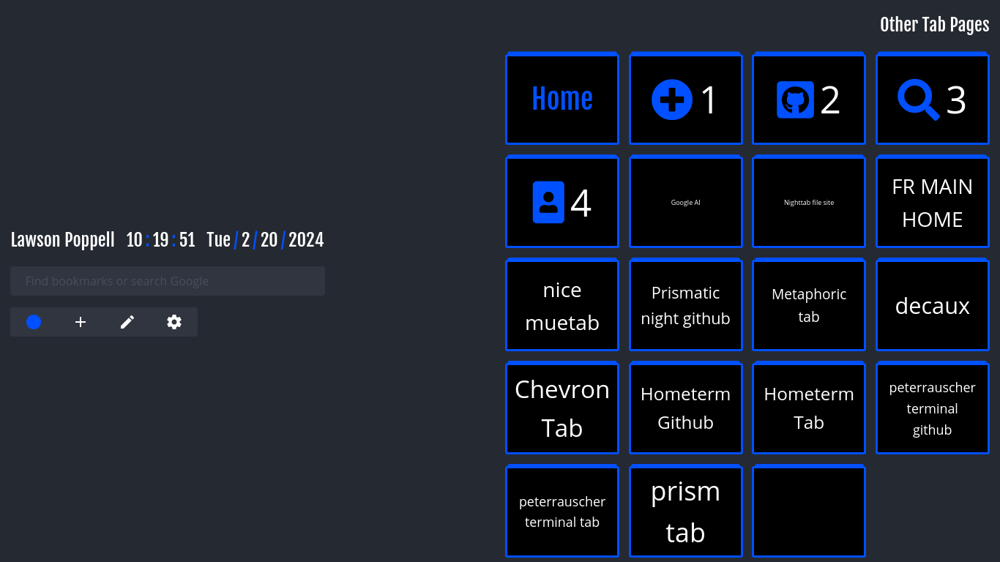
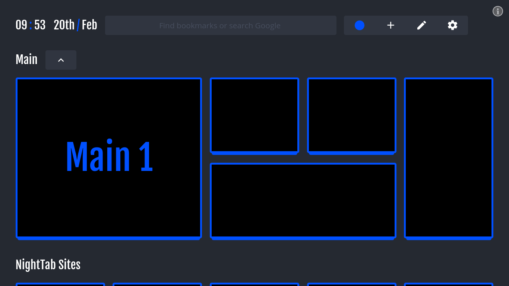

# Homepage
# [Homepage](Homepage)

# Links to the Nighttab Editors

- [daiyam](https://daiyam.github.io/nightTab/)
- [law-dawg360](https://law-dawg360.github.io/nightTabHome/)
- [zombiefox](https://zombiefox.github.io/nightTab/)

  Other HomeTabs
- [zombiefox hexagonTab](https://zombiefox.github.io/hexagonTab/)
  
  other links    
- [JSFiddle](https://jsfiddle.net/user/fiddles/all/)
- [DevDocs](https://devdocs.io/)
  
- https://raw.githubusercontent.com/Law-Dawg360/indexes/homepages/assets/screenshots/Screenshot_2024-02-20_001.png

  # Screenshots

# add to sites as bookmarks later
https://github.com/joelacus/Cobalt?tab=readme-ov-file
https://cobaltstart.pages.dev/

## Example nightTab setups:

- [Where to find these setups](https://github.com/zombieFox/nightTab/tree/main/asset/screenshot)
- [How to import these setups](https://github.com/zombieFox/nightTab/wiki/Data-backup-and-restore#restore-data)
  
# https://daiyam.github.io/nightTab/
# https://law-dawg360.github.io/nightTabHome/
# https://zombiefox.github.io/nightTab/

# Examples/Demos/
## Main 1 (Doesnt Open In New Tab) (2024-02-20 10.19.51 AM)    
| [raw text](https://raw.githubusercontent.com/Law-Dawg360/indexes/homepages/assets/jsons/oldmain1.json) | [JSON github link](https://github.com/Law-Dawg360/indexes/blob/homepages/assets/jsons/oldmain1.json) | [Full Screenshot](https://github.com/Law-Dawg360/indexes/blob/homepages/assets/screenshots/Screenshot_2024-02-20_001.png) |    
(Image is the link to the page)    

    
## Home (Doesnt Open In New Tab) (2024-02-21 7.51.23 AM)
| [raw text|](https://raw.githubusercontent.com/Law-Dawg360/indexes/homepages/assets/jsons/HomeMain1.json) | [JSON github link](https://github.com/Law-Dawg360/indexes/blob/homepages/assets/jsons/HomeMain1.json) | [Full Screenshot](https://github.com/Law-Dawg360/indexes/blob/homepages/assets/screenshots/Screenshot_2024-02-21_002.png) |    
(Image is the link to the page)    

    
## template
Title (Opens in New Tab?) (Time)
[raw text   |](https://raw.githubusercontent.com/Law-Dawg360/indexes/)[|   github link](https://github.com/Law-Dawg360/indexes/)    
## example
[raw text   |](https://raw.githubusercontent.com/Law-Dawg360/indexes/homepages/assets/jsons/HomeMain1.json)[|   github link](https://github.com/Law-Dawg360/indexes/blob/homepages/assets/jsons/HomeMain1.json)  

| [See the demo in action](https://zombiefox.github.io/nightTab/) | [Install nightTab Extension](https://chrome.google.com/webstore/detail/nighttab/hdpcadigjkbcpnlcpbcohpafiaefanki) | [Install nightTab Add On](https://addons.mozilla.org/en-GB/firefox/addon/nighttab/) | [Buy me a coffee](https://www.buymeacoffee.com/zombieFox/) | [Join the community](https://www.reddit.com/r/nighttab/) |
|:-------------:|:-------------:|:-------------:|:-------------:|:-------------:|
|  |  |  |  |  |

# pastebin
# Examples/Demos/
## Main 1 (Doesnt Open In New Tab) (2024-02-20 10.19.51 AM)
| [raw text   |](https://raw.githubusercontent.com/Law-Dawg360/indexes/homepages/assets/jsons/oldmain1.json) | [|   github link](https://github.com/Law-Dawg360/indexes/blob/homepages/assets/jsons/oldmain1.json) |

| [raw text   |](https://raw.githubusercontent.com/Law-Dawg360/indexes/homepages/assets/jsons/oldmain1.json) | [|   github link](https://github.com/Law-Dawg360/indexes/blob/homepages/assets/jsons/oldmain1.json) |
[raw text   |](https://raw.githubusercontent.com/Law-Dawg360/indexes/homepages/assets/jsons/oldmain1.json)[|   github link](https://github.com/Law-Dawg360/indexes/blob/homepages/assets/jsons/oldmain1.json)    

## Main 1 (Doesnt Open In New Tab) (2024-02-20 10.19.51 AM)
| [raw text](https://raw.githubusercontent.com/Law-Dawg360/indexes/homepages/assets/jsons/oldmain1.json) | [github link](https://github.com/Law-Dawg360/indexes/blob/homepages/assets/jsons/oldmain1.json) | [Full Screenshot, And the Image Is Link to the Site](https://github.com/Law-Dawg360/indexes/blob/homepages/assets/screenshots/Screenshot_2024-02-20_001.png) |
|:-------------:|:-------------:|:-------------:|
|  |  |  |
